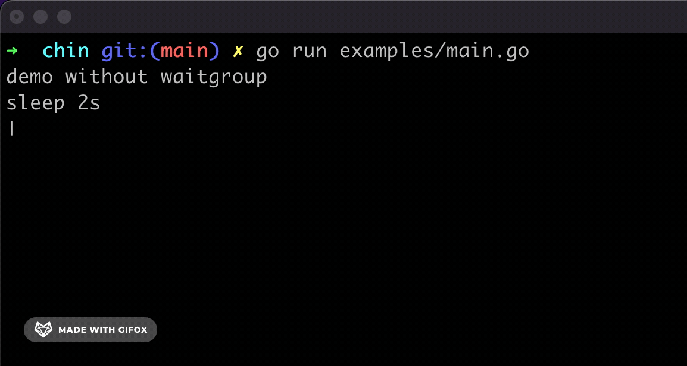

# adhocore/chin

[](https://goreportcard.com/report/github.com/adhocore/chin)
[](https://github.com/adhocore/chin/actions/workflows/lint-action.yml)
[](https://www.paypal.me/ji10/15usd)
[](https://www.paypal.me/ji10/25usd)
[](https://www.paypal.me/ji10/50usd)
[](https://twitter.com/intent/tweet?text=Golang+spinner+library+for+the+terminal&url=https://github.com/adhocore/chin&hashtags=golang,terminal,spinner,spin)


A Golang command line tool to show a spinner as you wait for some long running jobs to finish.

> This is a simple project but carries a tremendous value to me [❤️].

## Usage

Install `chin`:
```sh
go get -u github.com/adhocore/chin
```

Use in Go code with `WaitGroup`:

```go
var wg sync.WaitGroup

s := chin.New().WithWait(&wg)
go s.Start()

// invoke some long running task
// (you can also call s.Stop() from that task)
longTask(&wg)

s.Stop()
wg.Wait()
```
> Refer and run working [examples](./examples/main.go) with: `go run examples/main.go`

### Custom Spinner

You can choose from provided spinner sets `chin.Default`, `chin.Arrows` and `chin.Dots`:
```go
s := chin.New(chin.Arrows)
// or
s := chin.New(chin.Dots)

go s.Start()
```
> `chin.Default` is selected by default so you don't have to specify it.

You can also define your own spinner set with delay and animation chars like so:
```go
// Animates 0 to 4 in a gap of 50ms:
s := chin.New(chin.Set{50*time.Millisecond, []string{"0", "1", "2", "3", "4", "3", "2", "1"}})
go s.Start()
```

## Screen



---
### Other projects
My other golang projects you might find interesting and useful:

- [**gronx**](https://github.com/adhocore/gronx) - Lightweight, fast and dependency-free Cron expression parser (due checker), task scheduler and/or daemon for Golang (tested on v1.13 and above) and standalone usage.
- [**urlsh**](https://github.com/adhocore/urlsh) - URL shortener and bookmarker service with UI, API, Cache, Hits Counter and forwarder using postgres and redis in backend, bulma in frontend; has [web](https://urlssh.xyz) and cli client.
- [**fast**](https://github.com/adhocore/fast) - Check your internet speed with ease and comfort right from the terminal. (It uses `adhocore/chin`.)
- [**goic**](https://github.com/adhocore/goic) - Go Open ID Connect, is OpenID connect client library for Golang, supports the Authorization Code Flow of OpenID Connect specification.
- [**jsonc**](https://github.com/adhocore/jsonc) - Golang JSON parser supporting comments, trailing commas and literal newlines.
